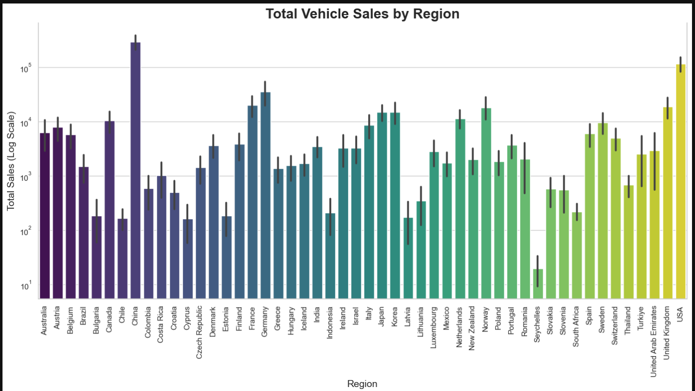
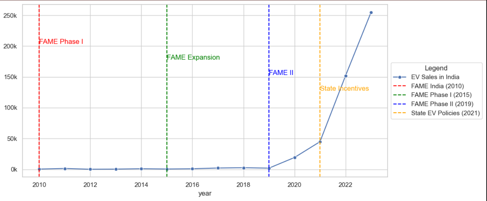
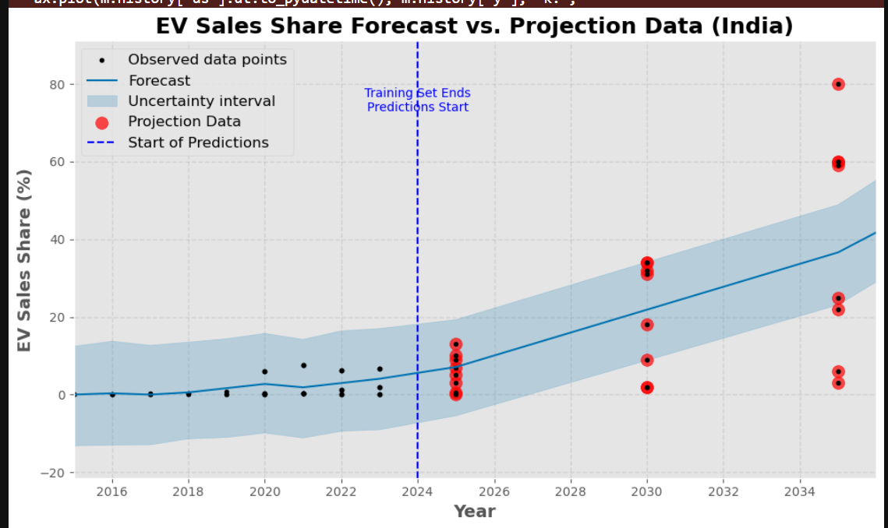
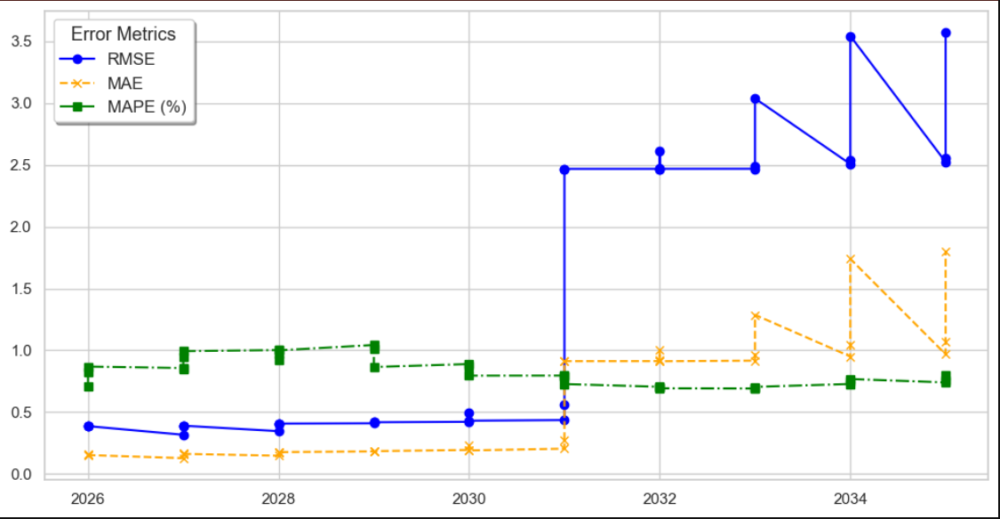

# **Global EV Market Analysis and Forecasting**

This project provides a comprehensive analysis of global Electric Vehicle (EV) trends from 2010 to 2024, exploring how policy interventions, market dynamics, and technological advancements have shaped EV adoption across major regions like China, the USA, Europe, and India. Leveraging advanced data exploration and forecasting methods, the project predicts future EV sales and market shares, offering actionable insights for policymakers and stakeholders.

---

## **Table of Contents**
1. [Abstract](#abstract)
2. [Technologies Used](#technologies-used)
3. [Key Features](#key-features)
4. [Installation and Setup](#installation-and-setup)
5. [Project Highlights](#project-highlights)
6. [Graphical Visualizations](#graphical-visualizations)
7. [Conclusion](#conclusion)
8. [License](#license)

---

### **Abstract**
The analysis evaluates historical EV sales data and government policy impacts while employing time series forecasting to project future trends (2025–2035). Key components include:
- Historical sales trend analysis across major regions.
- Policy effectiveness assessment for driving EV adoption.
- Predictive modeling for sales and stock shares using Prophet.

This project also highlights the role of subsidies, infrastructure investments, and regulatory mandates in shaping the EV market.

---

### **Technologies Used**
- **Languages & Libraries:**
  - Python (`Pandas`, `NumPy`, `Matplotlib`, `Seaborn`)
  - Time Series Forecasting (`Prophet`)
- **Tools:**
  - Jupyter Notebook for data analysis and visualization
  - Microsoft Word for the final report

---

### **Key Features**
1. **Data Analysis & Visualization:**
   - Trends in EV sales, market shares, and adoption rates globally.
   - Regional comparisons using visual tools like bar plots, scatter plots, and heatmaps.

2. **Policy Impact Analysis:**
   - Evaluation of government policies, including financial incentives, emission standards, and infrastructure investments.

3. **Time Series Forecasting:**
   - Forecasts for EV sales share and stock share across major regions using the Prophet model.

4. **Comparative Insights:**
   - Detailed comparisons of key regions (China, USA, Europe, and India), showcasing how specific policy interventions have driven EV adoption.

5. **Final Report:**
   - A comprehensive Word document summarizing findings, including policy advantages and regional success factors.

---

### **Installation and Setup**
Note: I have attached the pdf format of my notebook, if you have any suggestion ,please raise an issue and i will provide you with the notebook,
Till then you can view the summary of the project in the word document:
```bash
      https://github.com/Abhilove-Goyal/Global-EV-Analysis/blob/main/Global_ev_anaylsis(report)%20(1).pdf
```
---


### **Project Highlights**
#### **1. Historical Insights**
- Analysis of EV sales and stock trends from 2010 to 2024, highlighting the growth trajectory of the global EV market.
- Key findings:
  - **China**: Leading in EV sales with strong policy mandates like the NEV subsidy and quotas.
  - **Europe**: High EV adoption driven by stringent emission standards and widespread incentives.
  - **USA**: Growth attributed to federal tax credits and state-level policies.
  - **India**: Emerging player with initiatives like FAME II focusing on electric two-wheelers and infrastructure.

#### **2. Predictive Analysis**
- Time series forecasting using the **Prophet** model to predict:
  - **EV Sales Share**: Projected to reach 70% for new vehicle sales globally by 2034.
  - **Stock Share**: Gradual rise reflecting the transition from traditional ICE vehicles.
- Comparative forecasts for major regions to assess market potential and growth.

#### **3. Policy Evaluation**
- Analysis of government interventions, comparing:
  - Subsidies and incentives.
  - Charging infrastructure development.
  - Emission standards and mandates.

#### **4. Visual Insights**
- Dynamic visualizations showcasing:
  - **EV Sales Trends**: Historical trends in global EV sales across major countries, helping to identify growth patterns.
  - **Stock Shares**: Regional comparisons of stock shares and market penetration of EVs, highlighting the progress and potential growth in different regions.
  - **Forecasted Growth**: Time series forecasting of EV sales share and stock share for the coming years (2025–2035), providing future projections based on historical data and government policies.

The project also includes **detailed visualizations** to compare the impact of various **government policies** on EV adoption across regions like China, the USA, Europe, and India. These visualizations are key to understanding the relationship between policy interventions (such as subsidies, tax credits, and emissions standards) and EV adoption rates.

Additionally, a comprehensive **Word document report** is included, summarizing:
- The **methodology** used for data analysis and forecasting.
- A **comparison** of the EV market strategies employed by different countries and how these strategies have influenced market success.
- **Insights** into the effectiveness of government policies and how they could be leveraged to boost EV adoption in emerging markets.

This report serves as a valuable resource for stakeholders, policymakers, and researchers looking to understand the key drivers of the global EV market.
---

### **Graphical Visualizations**
Below are some key visualizations from the project:

1. **Global EV Sales Trends (2010–2024):**
   

2. **Sales graph correspding to Govt Schemes:**
   

3. **Time Series Forecast for EV Sales Share:**
   

4. **Accuracy graph for Forecast graph:**
   


---

### **Conclusion**
The findings underline the critical role of government policies in driving EV adoption. Key takeaways include:
- Comprehensive policies (subsidies + infrastructure) lead to faster adoption.
- Developed regions like China and Europe dominate due to strong policy support, while emerging markets like India show potential with targeted initiatives.

This project provides actionable insights for shaping future strategies in the EV market.

---

### **License**
This project is licensed under the MIT License. See the `LICENSE` file for details.

---

### **Acknowledgments**
- **Data Source**: EV sales and policy data obtained from reputable databases and government reports.
- **Tools**: Thanks to Python, Jupyter, and supporting libraries for facilitating this analysis.

---
